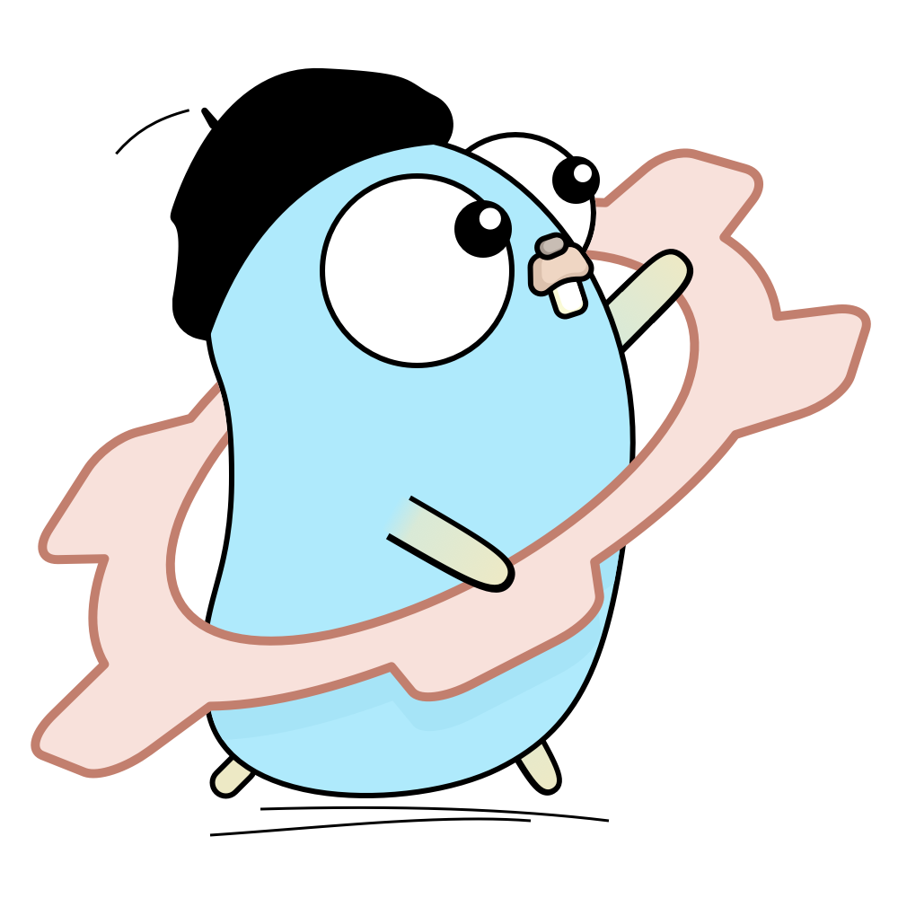

# `gonfique` - Type checked configs for Go programs



`gonfique` is a CLI tool for Go developers to automatically build exact **struct definitions** in Go that will match the provided YAML or JSON config. Makes instant to notice **when and where a breaking change** occurs. Since compiler warns whenever it happens by type-checking, and source control shows where the change exactly is.

## Example

Input:

```yaml
apiVersion: apps/v1
kind: Deployment
metadata:
  name: my-deployment
  namespace: my-namespace
type: Opaque
data:
  my-key: my-value
  password: cGFzc3dvcmQ=
spec:
  replicas: 3
  selector:
    matchLabels:
      app: my-app
  ports:
    - protocol: TCP
      port: 80
      targetPort: 80
  rules:
    - host: myapp.example.com
      http:
        paths:
          - path: /
            pathType: Prefix
            backend:
              service:
                name: my-service
                port:
                  number: 80
  template:
    metadata:
      labels:
        app: my-app
    spec:
      containers:
        - name: my-container
          image: my-image
          ports:
            - containerPort: 80
          envFrom:
            - configMapRef:
                name: my-config
            - secretRef:
                name: my-secret
```

Output:

```go
package config

import (
  "fmt"
  "os"

  "gopkg.in/yaml.v3"
)

type Config struct {
  ApiVersion string `yaml:"apiVersion"`
  Data       struct {
    MyKey    string `yaml:"my-key"`
    Password string `yaml:"password"`
  } `yaml:"data"`
  Kind     string `yaml:"kind"`
  Metadata struct {
    Name      string `yaml:"name"`
    Namespace string `yaml:"namespace"`
  } `yaml:"metadata"`
  Spec struct {
    Ports []struct {
      Port       int    `yaml:"port"`
      Protocol   string `yaml:"protocol"`
      TargetPort int    `yaml:"targetPort"`
    } `yaml:"ports"`
    Replicas int `yaml:"replicas"`
    Rules    []struct {
      Host string `yaml:"host"`
      Http struct {
        Paths []struct {
          Backend struct {
            Service struct {
              Name string `yaml:"name"`
              Port struct {
                Number int `yaml:"number"`
              } `yaml:"port"`
            } `yaml:"service"`
          } `yaml:"backend"`
          Path     string `yaml:"path"`
          PathType string `yaml:"pathType"`
        } `yaml:"paths"`
      } `yaml:"http"`
    } `yaml:"rules"`
    Selector struct {
      MatchLabels struct {
        App string `yaml:"app"`
      } `yaml:"matchLabels"`
    } `yaml:"selector"`
    Template struct {
      Metadata struct {
        Labels struct {
          App string `yaml:"app"`
        } `yaml:"labels"`
      } `yaml:"metadata"`
      Spec struct {
        Containers []struct {
          EnvFrom []struct {
            ConfigMapRef struct {
              Name string `yaml:"name"`
            } `yaml:"configMapRef"`
            SecretRef struct {
              Name string `yaml:"name"`
            } `yaml:"secretRef"`
          } `yaml:"envFrom"`
          Image string `yaml:"image"`
          Name  string `yaml:"name"`
          Ports []struct {
            ContainerPort int `yaml:"containerPort"`
          } `yaml:"ports"`
        } `yaml:"containers"`
      } `yaml:"spec"`
    } `yaml:"template"`
  } `yaml:"spec"`
  Type string `yaml:"type"`
}

func ReadConfig(path string) (Config, error) {
  file, err := os.Open(path)
  if err != nil {
    return Config{}, fmt.Errorf("opening config file: %w", err)
  }
  defer file.Close()
  c := Config{}
  err = yaml.NewDecoder(file).Decode(&c)
  if err != nil {
    return Config{}, fmt.Errorf("decoding config file: %w", err)
  }
  return c, nil
}
```

See outputs for different flag combinations:

- [`-mapping`](/examples/k8s/map/output.go)
- [`-organize`](/examples/k8s/organized/output.go)
- [`-organize`, `-use`](/examples/k8s/organized-used/output.go)

## Install

Use version tags to avoid development versions as such:

```sh
go install github.com/ufukty/gonfique@v1.4.1
```

## Usage

```sh
gonfique -in config.yml -out config.go -pkg main [-use <file>] [-organize]
```

## Features

- Specify names for detected types via `-mapping` flag to export safely. [More](docs/mapping.md)
- Defines named or inline types depending on user choice (`-organize` flag).
- Reuses user-defined types defined provided in a file when schemas match via `-use` flag
- Supports arrays:
  - When all array items share same schema; array types are generated as `[]<item type>`.
  - When all array items don't share same schema, but all items are compatible; array types are generated as `[]<combined item types>`.
- Supports dictionaries:
  - Implements `.Range()` method on those dictionaries that all values share same schema, so they can be iterable via for loops. Such as `for service, details := range cfg.Services.Range() { ... }`
- Supports `time.Duration` values such as `200ms` or `1µs`.
- Supports JSON and YAML config files.

## Docs

- [Why gonfique?](docs/why-gonfique.md)
- [Arrays](docs/arrays.md)
- [Mapping file](docs/mapping.md)
- [Suggestions](docs/suggestions.md)

## Limitations

- Multidocument YAML files are not supported.
- Mapping file is for generating an exported type definition with the given name and detected type; not to specify type.
- Type of keys with value of `null` gets assigned as `any`.

## Contribution

Issues are open for discussions and rest.

- [How it works?](docs/how-it-works.md)

## License

Apache2. See LICENSE file.
