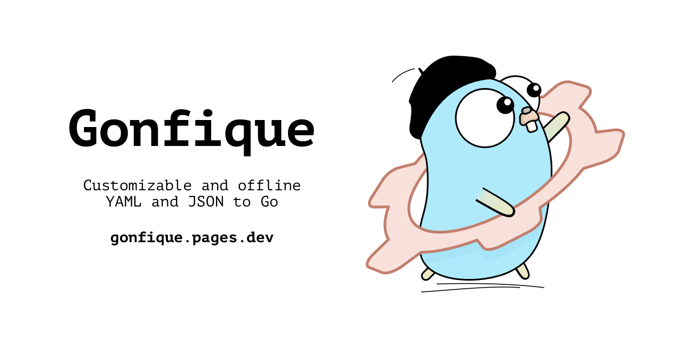

# Gonfique



Gonfique is a special kind of YAML-to-Go and JSON-to-Go that has the **customization options** developers need when they create mappings for config files. Gonfique also **works offline**. Unlike online services Gonfique is easier to integrate into build pipeline which makes effortless to keep mapping types always up-to-date.

Having Gonfique integrated into the build pipeline, developers can use extremely dynamic schemas like storing part of the config information in the keys. Dynamic keys are breeze to work with, as they make accessing particular entry a.dot.access.close. Before Gonfique, an update in the source file would need developer to open the online service and regenerate the mapping file. With Gonfique, _as the mapping file gets updated_, the LSP checks whole codebase at instant and IDE points to the files where a previously working config access went broken. So, the developer gets a chance to fix before prod.

```go
cfg.the.["road"].to.["panics"].is.["paved"].with.["hardcoded"]["strings"]
```

— a Gopher

```go
if r, ok := cfg.the.["road"]; ok {
  if p, ok := r.to.["panics"]; ok {
    if p2, ok := p.is.["paved"]; ok {
      if h, ok := p2.with.["hardcoded"]; ok {
        if s, ok := h.["strings"]; ok {
```

— a wise Gopher

```go
cfg.the.road.to.panics.is.paved.with.hardcoded.strings
```

— A. Gopherstein

## Why?

If you've never adopted a JSON-to-Go or YAML-to-Go; if this is first time you met one; if you are asking yourself why would not you write mapping types by hand then I dare you to find mistakes in this mapping type:

```yaml
github:
  domain: github.com
  path: /api/v1.0.0
  services:
    tags:
      path: tags
      endpoints:
        - name: list
          method: GET
          path: "list/{root}"
        - name: create
          method: POST
          path: "task"
        - name: assign
          method: POST
          path: "assign"
        - name: delete
          method: DELETE
          path: ""
gitlab:
  domain: gitlab.com
```

```go
type Endpoint struct {
  Name   string `yaml:"name"`
  Method string `yaml:"method"`
  Path   string `yaml:"path"`
}

type Tags struct {
  Path      string     `yaml:"path"`
  Endpoints []endpoint `yaml:"endpoint"`
}

type Service struct {
  Tags Tags `yaml:"tags"`
}

type Config struct {
  Github struct {
    Domain   int `yaml:"domain"`
    Path     int `yaml:"path"`
    Services []Service
  } `yaml:"github.com"`
}
```

This one was an easy one. No one have enough time to deal with this in repeat. You should find at least 6 mistakes depending on how you count.

## Features

- Works offline:
  - Private
  - Nicely integrates to build pipeline
- Rich customization:
  - Named or inline types
  - Auto generated or user provided typenames
  - Type replacement
  - Map/struct option for dicts
  - Implements methods on declared types:
    - Iterators
    - Accessors (getter/setter)
  - Enriches declared types:
    - Embedding other declared types
    - Parent refs
- Easy troubleshoot:
  - Path-directive kind mismatch
  - Directive value conflicts
  - Declaration conflicts
- Abstracts boring stuff:
  - Additive type creation for list-items and dict-values
- Attention to details:
  - Version stamping for reproducibility
  - Alphabetical sorting for minimal git diffs
- Supports JSON and YAML files

## Full examples

### With customization

#### Input

```yaml
domain: localhost
gateways:
  public:
    path: /api/v1.0.0
    services:
      document:
        path: document
        endpoints:
          get: { method: "GET", path: "/" }
          create: { method: "POST", path: "/" }
          delete: { method: "DELETE", path: "/" }
          patch: { method: "PATCH", path: "/" }
          put: { method: "PUT", path: "/" }
      objectives:
        path: tasks
        endpoints:
          get: { method: "GET", path: "/" }
          create: { method: "POST", path: "/" }
          delete: { method: "DELETE", path: "/" }
          patch: { method: "PATCH", path: "/" }
          put: { method: "PUT", path: "/" }
      tags:
        path: tags
        endpoints:
          get: { method: "GET", path: "/" }
          create: { method: "POST", path: "/" }
          delete: { method: "DELETE", path: "/" }
          patch: { method: "PATCH", path: "/" }
          put: { method: "PUT", path: "/" }
```

#### Gonfique config

```yml
meta:
  type: Config

rules:
  "**": { export: true }

  "**.objectives.endpoints": { declare: ObjectivesEndpoints }
  "<ObjectivesEndpoints>": { iterator: true }
  "<ObjectivesEndpoints>.*": { declare: Endpoint }

  "**.tags.endpoints": { declare: TagsEndpoints, dict: map }
  "<TagsEndpoints>.[value]": { declare: Endpoint }

  "**.endpoints.*": { declare: Endpoint }
  "<Endpoint>": { accessors: ["method", "path"] }
  "<Endpoint>.method": { replace: http.Method test/http }
```

#### Output

```go
// Code generated by gonfique test version. DO NOT EDIT.

package config

import (
  "fmt"
  "iter"
  "os"
  "test/http"

  "gopkg.in/yaml.v3"
)

// exported for domain
type Domain string

// exported for gateways.public.path
type Path string

// exported for gateways.public.services.document.path
type DocumentPath string

type Endpoint struct {
  Method http.Method `yaml:"method"`
  Path   string      `yaml:"path"`
}

func (e Endpoint) GetMethod() http.Method {
  return e.Method
}

func (e *Endpoint) SetMethod(v http.Method) {
  e.Method = v
}

func (e Endpoint) GetPath() string {
  return e.Path
}

func (e *Endpoint) SetPath(v string) {
  e.Path = v
}

// exported for gateways.public.services.document.endpoints
type Endpoints struct {
  Create Endpoint `yaml:"create"`
  Delete Endpoint `yaml:"delete"`
  Get    Endpoint `yaml:"get"`
  Patch  Endpoint `yaml:"patch"`
  Put    Endpoint `yaml:"put"`
}

// exported for gateways.public.services.document
type Document struct {
  Endpoints Endpoints    `yaml:"endpoints"`
  Path      DocumentPath `yaml:"path"`
}

type ObjectivesEndpoints struct {
  Create Endpoint `yaml:"create"`
  Delete Endpoint `yaml:"delete"`
  Get    Endpoint `yaml:"get"`
  Patch  Endpoint `yaml:"patch"`
  Put    Endpoint `yaml:"put"`
}

func (o ObjectivesEndpoints) Fields() iter.Seq2[string, Endpoint] {
  return func(yield func(string, Endpoint) bool) {
    mp := map[string]Endpoint{
      "create": o.Create,
      "delete": o.Delete,
      "get":    o.Get,
      "patch":  o.Patch,
      "put":    o.Put,
    }
    for k, v := range mp {
      if !yield(k, v) {
        return
      }
    }
  }
}

// exported for gateways.public.services.objectives.path
type ObjectivesPath string

// exported for gateways.public.services.objectives
type Objectives struct {
  Endpoints ObjectivesEndpoints `yaml:"endpoints"`
  Path      ObjectivesPath      `yaml:"path"`
}

type TagsEndpoints map[string]Endpoint

// exported for gateways.public.services.tags.path
type TagsPath string

// exported for gateways.public.services.tags
type Tags struct {
  Endpoints TagsEndpoints `yaml:"endpoints"`
  Path      TagsPath      `yaml:"path"`
}

// exported for gateways.public.services
type Services struct {
  Document   Document   `yaml:"document"`
  Objectives Objectives `yaml:"objectives"`
  Tags       Tags       `yaml:"tags"`
}

// exported for gateways.public
type Public struct {
  Path     Path     `yaml:"path"`
  Services Services `yaml:"services"`
}

// exported for gateways
type Gateways struct {
  Public Public `yaml:"public"`
}

type Config struct {
  Domain   Domain   `yaml:"domain"`
  Gateways Gateways `yaml:"gateways"`
}

func ReadConfig(path string) (*Config, error) {
  file, err := os.Open(path)
  if err != nil {
    return nil, fmt.Errorf("opening config file: %w", err)
  }
  defer file.Close()
  c := &Config{}
  err = yaml.NewDecoder(file).Decode(c)
  if err != nil {
    return nil, fmt.Errorf("decoding config file: %w", err)
  }
  return c, nil
}
```

### Without customization

#### Input

```yaml
apiVersion: apps/v1
kind: Deployment
metadata:
  name: my-deployment
  namespace: my-namespace
type: Opaque
data:
  my-key: my-value
  password: cGFzc3dvcmQ=
spec:
  replicas: 3
  selector:
    matchLabels:
      app: my-app
  ports:
    - protocol: TCP
      port: 80
      targetPort: 80
  rules:
    - host: myapp.example.com
      http:
        rules:
          - path: /
            pathType: Prefix
            backend:
              service:
                name: my-service
                port:
                  number: 80
  template:
    metadata:
      labels:
        app: my-app
    spec:
      containers:
        - name: my-container
          image: my-image
          ports:
            - containerPort: 80
          envFrom:
            - configMapRef:
                name: my-config
            - secretRef:
                name: my-secret
```

#### Output

```go
package config

import (
  "fmt"
  "os"

  "gopkg.in/yaml.v3"
)

type Config struct {
  ApiVersion string `yaml:"apiVersion"`
  Data       struct {
    MyKey    string `yaml:"my-key"`
    Password string `yaml:"password"`
  } `yaml:"data"`
  Kind     string `yaml:"kind"`
  Metadata struct {
    Name      string `yaml:"name"`
    Namespace string `yaml:"namespace"`
  } `yaml:"metadata"`
  Spec struct {
    Ports []struct {
      Port       int    `yaml:"port"`
      Protocol   string `yaml:"protocol"`
      TargetPort int    `yaml:"targetPort"`
    } `yaml:"ports"`
    Replicas int `yaml:"replicas"`
    Rules    []struct {
      Host string `yaml:"host"`
      Http struct {
        Paths []struct {
          Backend struct {
            Service struct {
              Name string `yaml:"name"`
              Port struct {
                Number int `yaml:"number"`
              } `yaml:"port"`
            } `yaml:"service"`
          } `yaml:"backend"`
          Path     string `yaml:"path"`
          PathType string `yaml:"pathType"`
        } `yaml:"paths"`
      } `yaml:"http"`
    } `yaml:"rules"`
    Selector struct {
      MatchLabels struct {
        App string `yaml:"app"`
      } `yaml:"matchLabels"`
    } `yaml:"selector"`
    Template struct {
      Metadata struct {
        Labels struct {
          App string `yaml:"app"`
        } `yaml:"labels"`
      } `yaml:"metadata"`
      Spec struct {
        Containers []struct {
          EnvFrom []struct {
            ConfigMapRef struct {
              Name string `yaml:"name"`
            } `yaml:"configMapRef"`
            SecretRef struct {
              Name string `yaml:"name"`
            } `yaml:"secretRef"`
          } `yaml:"envFrom"`
          Image string `yaml:"image"`
          Name  string `yaml:"name"`
          Ports []struct {
            ContainerPort int `yaml:"containerPort"`
          } `yaml:"ports"`
        } `yaml:"containers"`
      } `yaml:"spec"`
    } `yaml:"template"`
  } `yaml:"spec"`
  Type string `yaml:"type"`
}

func ReadConfig(path string) (Config, error) {
  file, err := os.Open(path)
  if err != nil {
    return Config{}, fmt.Errorf("opening config file: %w", err)
  }
  defer file.Close()
  c := Config{}
  err = yaml.NewDecoder(file).Decode(&c)
  if err != nil {
    return Config{}, fmt.Errorf("decoding config file: %w", err)
  }
  return c, nil
}
```

## Considerations

- Multidocument YAML files are not supported, caused by the decoder.
- Gonfique assigns `any` when sees `null` values. Consider use of `replace` directive in such targets.

## Contribution

Issues are open for discussions and rest.

## Stargazers over time


## License

Apache2. See LICENSE file.
